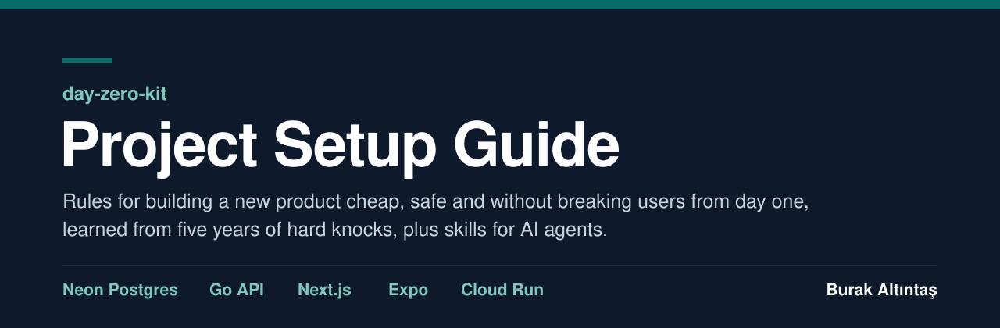

<p align="center"></p>

<p align="center"><a href="README.md">Türkçe</a> &nbsp;|&nbsp; <b>English</b></p>

<h3 align="center">Build everything around a new product before you write its code.</h3>

<p align="center">Accounts, environments, budget alarms and spend limits, the bot door, alerts, backups, the mobile kit and project memory ready from day one;<br>the team looks only at product flows while an AI agent builds the infrastructure from the guide.</p>

<p align="center"><b>English agent instructions, Turkish source guide.</b></p>

<p align="center">
  <a href="guide/project-setup-guide.pdf"><b>Read the guide (PDF, Turkish)</b></a>
  &nbsp;&nbsp;|&nbsp;&nbsp;
  <a href="guide/project-setup-guide.md"><b>Give it to your agent (Markdown)</b></a>
  &nbsp;&nbsp;|&nbsp;&nbsp;
  <a href="#skill-set"><b>Install the skills</b></a>
</p>

---

## What this is, and whose

This guide and skill set are my work, **Burak Altıntaş**. The rules come from five years of building products: the hard knocks I took, the bills I paid and the fixes I found. Databases that never slept, paid APIs switched on with no cap, bots scraping a catalogue, credits that ran out without telling anyone, users stuck on an old version who could not see a new flow. In the last three months I turned that experience into a guide, with the numbers.

I am sharing this sincerely. To me, it is a guide to getting somewhere with fewer knocks. Yes, it is long; but the work is not easy either.

The guide does not write your product's code; it builds everything around it so the work starts organised. The products appear anonymously as Product A, B, C and D (Ürün A–D); the numbers come from their bills, logs and incident records from August to October 2026.

**Language:** the guide (PDF and Markdown) is in Turkish. AI agents read it fine and can answer you in English. The skill set comes in Turkish and English: in the English set the instructions are English, while the guide sections the skills carry stay Turkish.

## Knocks taken, goals scored

<p align="center"></p>

## Two roads

| | The road without precautions | The road with precautions |
|---|---|---|
| **Who does what** | The team looks at product flows and approves whatever the agent proposes. | The team makes the decisions; the agent builds the infrastructure in the guide's order. |
| **Defaults** | Stock service account, uncapped API key, local settings pointing at production, services with no alarms. | Separate billing and budget alarms, a database that can sleep, a bot door, tested alarms, verified backups. |
| **Who tells you about a problem** | The bill, or luck. | An alarm, tested on day one. |
| **Spending** | You see it when the bill arrives. | A budget alarm tells you; what actually stops spending is separate for each service. |
| **Our bill** | **~₺3,900–4,400** a month in September | **~₺1,300** a month after the fixes |

A budget alarm does not stop spending; it only tells you. What stops it is different for each service, and some services have nothing that stops it: the Cloud Run spend cap, the Neon Free quota, a paid API provider's quota. The guide says which one each service has, and where there is no hard stop.

## Quick start

### 1. Give the guide to your agent

Pick one: install the plugin (below; the `project-setup` skill carries the full guide), or copy `guide/project-setup-guide.md` into the new product's repository, for example under `docs/`. Then paste this to your agent:

```
We are building a new product: <the product in one sentence; who uses it>.
The attached project-setup-guide.md is the guide for this work. It is written in Turkish; read it as it is and talk to me in English.

1. Read the guide end to end, including templates, rules and tables. It is long; read it section by section and reopen a layer's section while you build it.
2. Ask me the questions in the "Verilecek kararlar" (decisions) section one by one. If I have no preference, propose the guide's default and give the reason in one sentence.
3. Write the answers to docs/DECISIONS.md starting at K-001, and the product summary to AGENTS.md. A question without an answer stays as "DECISION PENDING".
4. Before any infrastructure, open the day-0 files from the "Proje hafızası ve devir" (project memory) section: AGENTS.md, CLAUDE.md (only @AGENTS.md), CHANGELOG.md, docs/STATUS.md, docs/TODO.md, docs/DECISIONS.md, docs/runbooks/ and docs/handoff/.
5. Apply the "Ajanın kurulum planı" (setup plan) phase by phase. At the end of each phase run its checks, write the result to docs/STATUS.md and CHANGELOG.md, and give me a one-line report. Do not move on from a phase whose checks fail.
6. Stop and ask for anything only I can do: opening accounts, payments and paid plans, accepting terms and contracts, domain registration and ownership checks, store accounts, granting an app access to an account (GitHub App, OAuth consent), submitting forms on outside sites, settings only the console can change, production deploys, mobile builds and store submission, messages to real users, making anything public.
7. If my request conflicts with the guide, say so before starting. I decide; you record it in DECISIONS.md.
8. Tags are evidence levels: [kanıtlı] runs in production in the guide's products, [ölçüldü] a measurement or bill shows the number, [öneri] not tried in those products or based only on vendor docs. [öneri] does not mean optional; skipping an item is my decision.
9. Never write secret values to the chat, files, commits or logs; names go in .env.example, values in Secret Manager. Experiments happen in the test environment; no test data is written to production.
10. Before any step that depends on a price, quota or version, re-read the number from the page in the guide's sources ("Kaynaklar") and tell me if it does not match.
```

The agent first asks the decisions one by one, writes the answers to `docs/DECISIONS.md`, opens the project memory files and applies the setup plan phase by phase. It stops and asks you for accounts, payments, domains, stores, production deploys and anything public.

### 2. Install the skills

In Claude Code:

```text
/plugin marketplace add buraltintas/day-zero-kit
/plugin install day-zero-kit-en@day-zero-kit
```

Skills are called like `/day-zero-kit-en:project-setup`; the agent also uses them on its own when the topic comes up. For the Turkish set, install `day-zero-kit-tr@day-zero-kit`.

To install by hand, copy the folders under `plugins/day-zero-kit-en/skills/`:

| Where | Path |
|---|---|
| This project only (Claude Code) | `.claude/skills/` |
| All projects (Claude Code) | `~/.claude/skills/` |
| Codex | `.agents/skills/` or `~/.agents/skills/` |

<a id="skill-set"></a>

## The skill set

For the first setup and for checks and decision support in the months that follow:

| Skill | When | What it does |
|---|---|---|
| `project-setup` | Starting a new product | Asks the decisions, opens the memory files, builds the infrastructure from day 0 phase by phase and verifies it. |
| `decision-support` | "Should we do this or that?" | For paid APIs, plans, analytics, real-time delivery, OTA, region and more: lays out options with real numbers and records the decision. |
| `release-gate` | Before a store release or a production deploy | Runs the release gate and recommends ship or no-ship with evidence, counting remaining builds and users on old versions. |
| `cost-audit` | Monthly, or when the bill rises | Fix list for database wake-ups, instance caps, spend caps, quotas and build minutes. |
| `security-audit` | Before release and monthly | Findings on permissions, secrets, dependencies, reading other users' records, the bot door and KVKK (Turkey's personal data protection law). |
| `project-memory` | At the end of every task and session | Updates CHANGELOG, STATUS, TODO, DECISIONS and the handoff note so a newcomer starts fast. |
| `alert-audit` | At setup and for every new external dependency | Checks that every error, credit, quota and expiry reaches the right person through the right channel. |
| `seo-geo-routine` | Weekly and monthly | Runs SEO and GEO work; first checks that bots do not wake the database. |

## What the guide covers

- **Getting started:** Two roads, how to use the guide, the decisions to make and the agent's setup plan, the fastest setup path, a case book of 30 cases.
- **Rules:** Changing things without breaking users; project memory and handoff.
- **Layers:** Postgres (Neon), Go API, Next.js, Expo, the mobile remote-control kit, mobile distribution, edge and DNS, Cloud Run, CI/CD, security and bots, e-mail, content automation, observability, alerts, analytics and admin, backups.
- **Product and growth:** Real-time and messaging, design system, SEO and GEO.
- **Money and speed:** What it costs, startup credits, free tiers, expensive external APIs, performance.
- **The end:** Repo and build rules, KVKK, the checklist, the never list, day-0 precautions, sources.

Every rule carries an evidence tag: **kanıtlı** (proven in our production), **ölçüldü** (our own measurement or bill shows the number), **öneri** (not tried by us, or based only on vendor docs). Öneri does not mean optional.

## What this guide is not

It is not a one-to-one recipe for every stack. The guide was written for this one: Neon Postgres, Go on Cloud Run, Next.js and Expo. On another stack the settings, numbers and tools change; the logic stays the same: do not wake the database for nothing, put a cap and an alarm on every spend, leave no silent failure, run with least privilege, change without breaking users, and write down decisions and project memory.

It is not a guide for very high scale or multi-region setups. It is not legal advice. Prices and versions are a snapshot of October 2026 (1 USD = 49 TL); re-read them from the official pages in the sources before you rely on them.

## Author

**Burak Altıntaş** ([@buraltintas](https://github.com/buraltintas)). The experience, numbers and fixes in this guide come from my products.

© 2026 Burak Altıntaş.

## License

The guide text (`guide/` and the guide sections in the skills' `references/` folders) is shared under [CC BY 4.0](guide/LICENSE): you may use, adapt and share it with attribution. The skills and everything else in the repository are under the [MIT](LICENSE) license.
