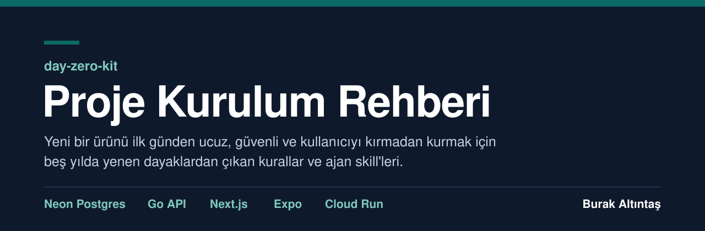

<p align="center"></p>

<p align="center"><b>Türkçe</b> &nbsp;|&nbsp; <a href="README.en.md">English</a></p>

<h3 align="center">Yeni bir ürünün kodunu yazmadan önce etrafını kur.</h3>

<p align="center">Hesaplar, ortamlar, maliyet tavanları, bot kapısı, uyarılar, yedek, mobil kit ve proje hafızası ilk günden hazır olsun;<br>ekip yalnız ürün akışına baksın, altyapıyı yapay zekâ ajanı rehberle kursun.</p>

<p align="center">
  <a href="guide/project-setup-guide.pdf"><b>Rehberi oku (PDF)</b></a>
  &nbsp;&nbsp;|&nbsp;&nbsp;
  <a href="guide/project-setup-guide.md"><b>Ajana ver (Markdown)</b></a>
  &nbsp;&nbsp;|&nbsp;&nbsp;
  <a href="#skill-seti"><b>Skill setini kur</b></a>
</p>

<p align="center"><sub>A Turkish playbook and Claude Code skill set for setting up a new product on Neon Postgres, Go, Next.js and Expo, written from real bills, logs and incidents.</sub></p>

---

## Bu nedir, kimin

Bu rehber ve skill seti benim, **Burak Altıntaş**'ın çalışması. İçindeki kurallar, beş yıl boyunca ürün kurarken yediğim dayaklardan, ödediğim faturalardan ve bulduğum çözümlerden çıktı: uyumayan veritabanları, tavansız açılan ücretli API'ler, kataloğu kazıyan botlar, kimseye haber vermeden biten krediler, eski sürümde kalıp yeni akışı göremeyen kullanıcılar. Son üç ayda bu tecrübeyi rakamlarıyla birlikte rehbere dönüştürdüm.

Bunu samimi olarak paylaşıyorum. Bence bu, az dayakla bir noktaya gelebilmenin rehberi. Uzun bir yazı, evet; ama iş de kolay değil.

Rehber ürünün kodunu yazmaz; kodun etrafını kurar ve işin derli toplu başlamasını sağlar. Ürünler rehberde Ürün A, B, C ve D diye anonim geçer; rakamlar bu ürünlerin Ağustos ile Ekim 2026 arasındaki faturalarından, loglarından ve olay kayıtlarından.

## Yenen dayaklar, atılan goller

<p align="center"></p>

## İki yol

| | Önlemsiz yol | Önlemli yol |
|---|---|---|
| **Kim ne yapar** | Ekip ürün akışına bakar, ajanın önerdiği her şeyi onaylar. | Ekip kararları verir, ajan altyapıyı rehberdeki sırayla kurar. |
| **Varsayılanlar** | Hazır servis hesabı, kotasız API anahtarı, canlıya bağlı yerel ayar, alarmsız servis. | Ayrı faturalama ve bütçe alarmı, uyuyabilen veritabanı, bot kapısı, denenmiş alarmlar, doğrulanan yedek. |
| **Sorunu kim haber verir** | Fatura ya da tesadüf. | Alarm; ilk gün denenmiş olarak. |
| **Bizim faturamız** | Eylül'de ayda **~₺3.900–4.400** | Düzeltmelerden sonra ayda **~₺1.300** |

## Hızlı başlangıç

### 1. Rehberi ajana ver

İki yoldan birini seç: eklentiyi kur (aşağıda; `project-setup` skill'i tam rehberi yanında taşır) ya da `guide/project-setup-guide.md` dosyasını yeni ürünün deposuna, örneğin `docs/` altına kopyala. Sonra ajana şu mesajı yapıştır:

```
Yeni bir ürün kuruyoruz: <ürün tek cümleyle; kim kullanır>.
Ekteki project-setup-guide.md bu işin rehberi.

1. Rehberi baştan sona oku; şablonlar, kurallar ve tablolar dahil. Dosya uzun; bölüm bölüm oku, kurarken o katmanın bölümünü yeniden aç.
2. "Verilecek kararlar" bölümündeki soruları bana tek tek sor. Bir tercihim yoksa rehberin varsayılanını öner ve nedenini bir cümleyle söyle.
3. Cevapları docs/DECISIONS.md'ye K-001'den başlayarak yaz, ürün özetini AGENTS.md'ye. Cevabı gelmeyen satır "KARAR BEKLİYOR" diye kalır.
4. Altyapıdan önce "Proje hafızası ve devir" bölümündeki gün 0 dosyalarını aç: AGENTS.md, CLAUDE.md (yalnız @AGENTS.md), CHANGELOG.md, docs/STATUS.md, docs/TODO.md, docs/DECISIONS.md, docs/runbooks/ ve docs/handoff/.
5. "Ajanın kurulum planı"nı aşama aşama uygula. Her aşamanın sonunda o aşamanın kontrollerini çalıştır, sonucu docs/STATUS.md'ye ve CHANGELOG.md'ye yaz, bana tek satır rapor ver. Kontrolü geçmeyen aşamadan sonrakine geçme.
6. Yalnız benim yapabileceğim işlerde dur ve sor: hesap açmak, ödeme ve ücretli plan, şart ve sözleşme kabulü, alan adı kaydı ve sahiplik doğrulaması, mağaza hesapları, bir uygulamaya hesap erişimi vermek (GitHub App, OAuth onayı), dış sitelerde form göndermek, yalnız konsoldan açılabilen ayarlar, canlıya deploy, mobil build ve mağazaya gönderim, gerçek kullanıcılara mesaj, bir şeyi herkese açık yapmak.
7. İsteğim rehberle çelişirse işe başlamadan çelişkiyi söyle. Kararı ben veririm, sen DECISIONS.md'ye yazarsın.
8. Etiketler kanıt düzeyidir: [kanıtlı] rehberin ürünlerinde canlıda çalışıyor, [ölçüldü] rakamı ölçüm ya da fatura gösteriyor, [öneri] o ürünlerde denenmedi ya da yalnız sağlayıcı belgesine dayanıyor. [öneri] isteğe bağlı demek değildir; bir maddeyi atlamak da benim kararımdır.
9. Gizli değerleri sohbete, dosyaya, commit'e ya da loga yazma; adları .env.example'da, değerleri Secret Manager'da durur. Denemeler test ortamında yapılır, canlıya test verisi yazılmaz.
10. Fiyat, kota ya da sürüme dayanan her adımdan önce rakamı rehberin Kaynaklar bölümündeki sayfadan yeniden oku; tutmayanı bana söyle.
```

Ajan önce kararları tek tek sorar, cevapları `docs/DECISIONS.md`'ye yazar, proje hafızası dosyalarını açar ve kurulum planını aşama aşama uygular. Hesap, ödeme, alan adı, mağaza, canlıya deploy ve herkese açma gibi işlerde durur ve sana sorar.

### 2. Skill setini kur

Claude Code içinde:

```text
/plugin marketplace add buraltintas/day-zero-kit
/plugin install day-zero-kit-tr@day-zero-kit
```

Skill'ler `/day-zero-kit-tr:project-setup` gibi çağrılır; konusu açılınca ajan kendisi de kullanır. İngilizce sürüm için `day-zero-kit-en@day-zero-kit` kurulur.

Elle kurmak istersen `plugins/day-zero-kit-tr/skills/` altındaki klasörleri kopyala:

| Nereye | Yol |
|---|---|
| Yalnız bu proje (Claude Code) | `.claude/skills/` |
| Bütün projeler (Claude Code) | `~/.claude/skills/` |
| Codex | `.agents/skills/` ya da `~/.agents/skills/` |

<a id="skill-seti"></a>

## Skill seti

İlk kurulumda da, sonraki aylarda da kontrol ve karar desteği için:

| Skill | Ne zaman | Ne yapar |
|---|---|---|
| `project-setup` | Yeni ürüne başlarken | Kararları sorar, hafıza dosyalarını açar, altyapıyı gün 0'dan aşama aşama kurar ve doğrular. |
| `decision-support` | "Şunu mu yapalım, bunu mu?" | Ücretli API, plan, analitik, gerçek zamanlı iletişim, OTA, bölge gibi kararlarda seçenekleri gerçek rakamlarla koyar, kararı kaydeder. |
| `release-gate` | Mağaza sürümünden ve canlıya deploy'dan önce | Yayın kapısını çalıştırır, kanıtla "çıkar / çıkmaz" önerir, build hakkını ve eski sürümdeki kullanıcıyı hesaba katar. |
| `cost-audit` | Ayda bir ya da fatura yükselince | Veritabanı uyanışı, instance tavanı, harcama freni, kota ve build dakikası için düzeltme listesi çıkarır. |
| `security-audit` | Yayından önce ve ayda bir | Yetkiler, sırlar, bağımlılıklar, başkasının kaydını okuma, bot kapısı ve KVKK için bulgu listesi verir. |
| `project-memory` | Her işin ve oturumun sonunda | CHANGELOG, STATUS, TODO, DECISIONS ve devir notunu günceller; yeni gelen hızla başlar. |
| `alert-audit` | Kurulumda ve her yeni dış bağımlılıkta | Her hata, kredi, kota ve süre dolumunun doğru kişiye, doğru kanaldan ulaştığını doğrular. |
| `seo-geo-routine` | Haftada ve ayda bir | SEO ve GEO işlerini yürütür; önce botların veritabanını uyandırmadığını kontrol eder. |

## Rehberde neler var

- **Başlarken:** İki yol, rehberin kullanımı, verilecek kararlar ve ajanın kurulum planı, en hızlı kurulum yolu, 30 vakalık vaka defteri.
- **Kurallar:** Kullanıcıyı kırmadan değiştirmek, proje hafızası ve devir.
- **Katmanlar:** Postgres (Neon), Go API, Next.js, Expo, mobil uzaktan kontrol kiti, mobil dağıtım, kenar ve DNS, Cloud Run, CI/CD, güvenlik ve botlar, e-posta, içerik otomasyonu, gözlem, uyarılar, analitik ve admin, yedek.
- **Ürün ve büyüme:** Gerçek zamanlı ve mesajlaşma, tasarım sistemi, SEO ve GEO.
- **Para ve hız:** Ne tutar, startup kredileri, ücretsiz katmanlar, pahalı dış API'ler, performans.
- **Son:** Depo ve build kuralları, KVKK, kontrol listesi, asla listesi, gün 0 önlemleri, kaynaklar.

Her kural bir kanıt etiketi taşır: **kanıtlı** bizim canlıda çalışıyor, **ölçüldü** rakamı kendi ölçümümüz ya da faturamız gösteriyor, **öneri** bizde denenmedi ya da yalnız sağlayıcı belgesine dayanıyor. Öneri, isteğe bağlı demek değildir.

## Bu rehber ne değildir

Her yığın için birebir tarif değildir. Rehber bu yığın için yazıldı: Neon Postgres, Cloud Run'da Go, Next.js ve Expo. Başka bir yığında ayarlar, rakamlar ve araçlar değişir; mantık aynı kalır: veritabanını gereksiz uyandırma, her harcamaya tavan ve alarm koy, sessiz hata bırakma, en az yetkiyle çalış, kullanıcıyı kırmadan değiştir, kararları ve hafızayı yaz.

Çok yüksek ölçek ya da çok bölgeli kurulum rehberi değildir. Hukuki görüş değildir. Fiyatlar ve sürümler Ekim 2026'nın fotoğrafıdır (1 USD = 49 TL); kullanmadan önce kaynaklardaki resmi sayfalardan yeniden okunur.

## Yazar

**Burak Altıntaş** ([@buraltintas](https://github.com/buraltintas)). Rehberdeki deneyim, rakamlar ve çözümler benim ürünlerimden.

© 2026 Burak Altıntaş.

## Lisans

Rehber metni (`guide/` ve skill'lerin `references/` klasörlerindeki bölümler) [CC BY 4.0](guide/LICENSE) ile paylaşılır: kaynak gösterilerek kullanılabilir, uyarlanabilir ve dağıtılabilir. Skill'ler ve depodaki diğer her şey [MIT](LICENSE) lisanslıdır.
